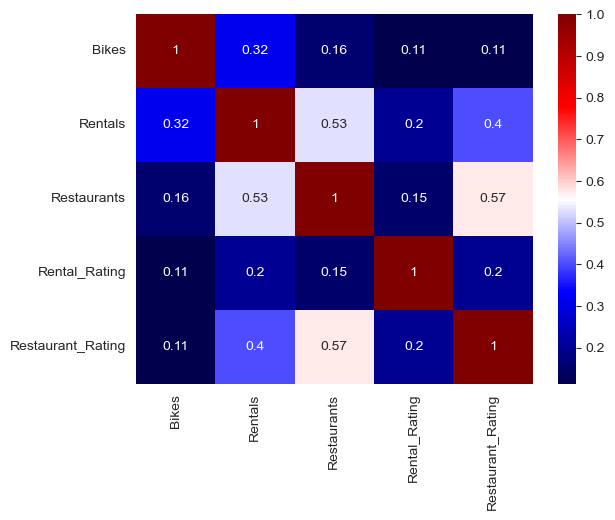
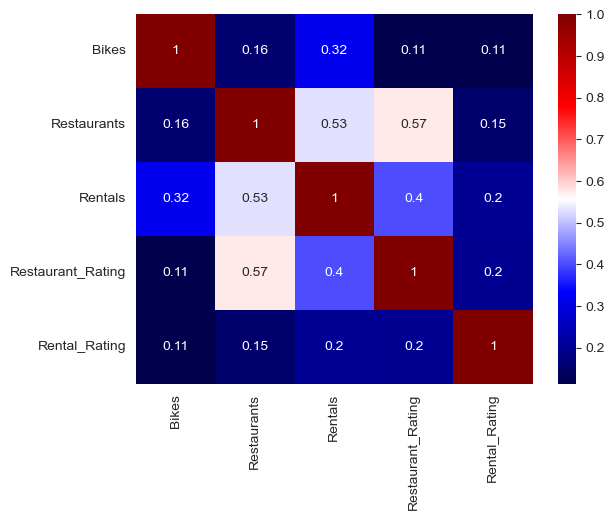
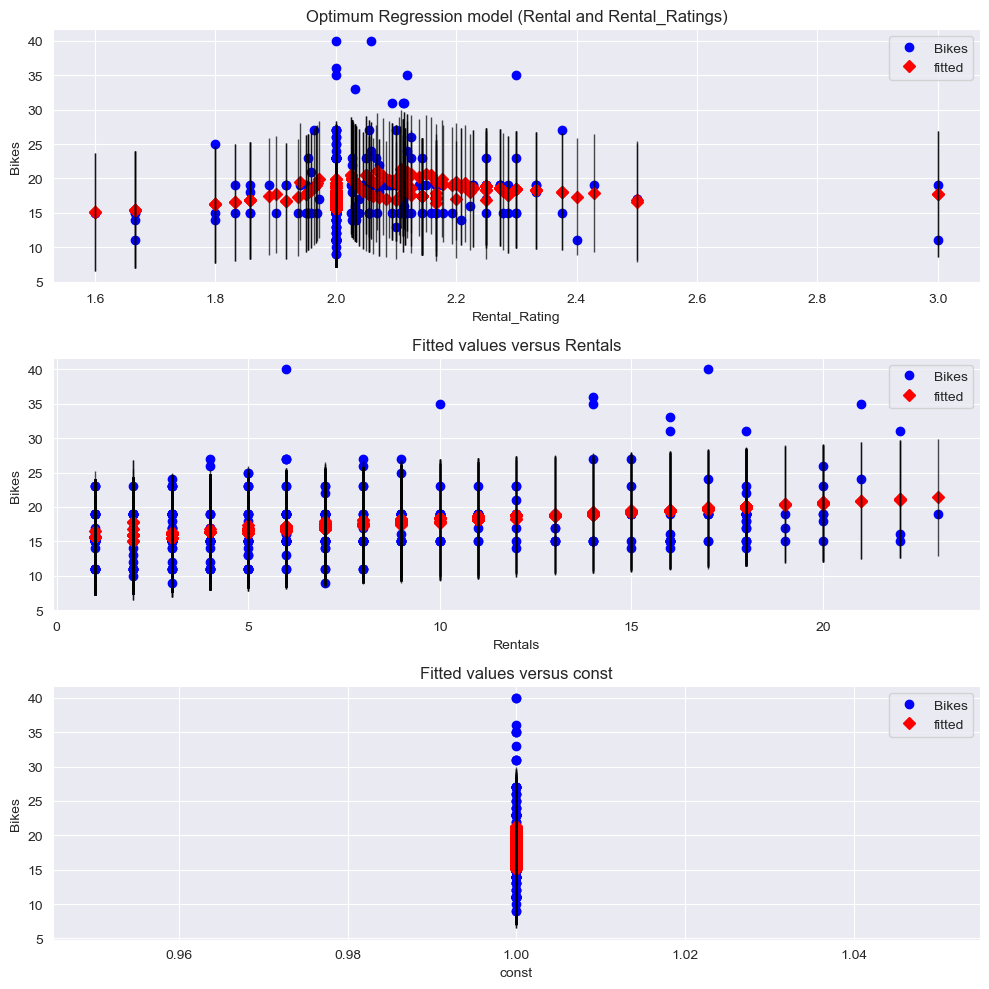

# Final-Project-Statistical-Modelling-with-Python

## Project/Goals
The objective of this project was to analyze the places of interest in the vicinity of bike stations in certain locations. But more significantly, it was to practice the skills gained during the first 3 weeks of bootcamp. I gained experience in the following:

1. Accessing data using APIs
2. Cleaning and transforming data using Python
3. Loading data into a database using Python
4. Performing EDA, including using both statistics and visualizations
5. Identifying trends and patterns in data using statistical models
6. Interpreting the results of the statistical models

## Process
### 1. Selecting a City and an Alternative Place of Interest:
**City**: Boston, Massachussetts. The results of querying the Citybikes Developer API was a single bike station company - . [Blue Bikes](https://www.bluebikes.com/) Blue Bikes is a state-sponsored public bike transportation network with over 4,000 bikes and 400 stations servicing metro Boston.

**Place of Interest**: In addition to the instructions to collect data on Restaurants, I also collected data on 'Car Rentals'. I thought it would be interesting to observe the influence, if any, that the car rental business has on the proliferation of biking stations. 

### 2. Data Retrieval of the Places of Intereste
The Citybikes, Yelp and FourSquares Developer websites have detailed documentation and instructions on how to use their API to retrieve location data. Of particular interest is the documentation on their category listings, and how to query more specific information.

- [Yelp Category Listing](https://docs.developer.yelp.com/docs/resources-categories)
- [Four Squares Category Listing](https://location.foursquare.com/places/docs/categories)
The data was retrieved as .json() files and relevant dictionary values were parsed into Pandas DataFrames. I collected: `Name`, `ID` (for Yelp and FourSquares), `Categories`, `Review Count` and `Ratings`. The latter two were only provided by Yelp. I later realized the `Categories` field was not relevant in this project. However, my steps in processing the category list can be seen in the relevant Notebook.

### 3. Data Cleaning and Inspection:
#### 1. Handling duplications
By doing a rough inspection of the data, I discovered that the `pd.unique()` was an insufficient identifier for unique values of the business names. There were several similar names which were used inter-changeably but stored as separate records with their own unique IDs. Using a combination of Regular Expressions and Python string methods, I identified and deleted some of the duplicated data. A more thorough investigation would still be recommended. 
I also decided to replace the unique IDs that came with the JSON file with my own indexing as they were not strictly unique. 

#### 2. Handling Null Data
I used different strategies to handle missing and NaN data. Due to the observed wide range of values in the data, Mean was not appopriate as a measure of central tendency. Where a central value was appropriate, I used median scores. I also used minimum in the fields for `Review Count`. 

### 4. Joining the Data

After confirming that the information I compiled was unique and distinct, I proceeded to join the data.   I had previously merged the API data into 2 tables – `restaurants` and `rentals`. I then joined those 2 tables using `pd.concat` into  a large table `places_of_Interest`. I joined `places_of_Interest` and `stations` with pd.merge. I used the Bike Station ID as the key (primary for the stations dataframe, and foreign for the Restaurants and Car dataframe), as the join point.
This created a large table that I used `groupby` to calculate values like average reviews and ratings across the different bike stations. This was important data for the later modelling.

#### Visualization
Prior to modelling, I ran some visualization functions to see how the data looked like: to identify potential outliers, to understand the distrubution of data, etc.
[Histogram](images/variable_distributions.png)

### 5. Creating the Database
The database was SQLite3 which is an on-device database server (not cloud based). I used the Python libraries for interfacing the SQLite server of `sqlite3` and `sqlalchemy`. I created 3 tables: `stations`, `places`, `stations_and_places`. `stations_and_places` is a cross-indexing table that interfaces the `stations` and `places`. Therefore leaving the other 2 tables with only unique information about their locations (ID, Name, Latitude and Longitude). I used SQLite for creating the tables and SQLAlchemy for updating and retrieving records, because it seemed more user-friendly although that is a matter of opinion.

### 6. Modelling:
The purpose of process was to build a model that could be used to predict the Number of Bikes based on the information of the places of interest i.e. their numbers within the station’s vicinity, and their average ratings. 
- **Step One**: I pared the data down to what was relevant: the Numbers of Bikes, the Numbers of Restaurants, the Number of Rentals, Restaurant Rating, Rental Ratings. `Bikes` is the Target/Dependent Variable and the other 4 are the Independent variables. I also renamed their columns for simplicity.
- **Step Two**:	I explored the data by boxchart and other seamap diagrams. I further cleaned the data by removing extreme outliers. I noticed some relationships via the scatter pots and correlation matrixes and I formed some theories which I would confirm via the Linear Regression analysis.

- **Step Three**: I used the `statsmodel` libraries to create a Linear Regression model. I used the *Forward Selection* strategy. I ran the analysis in an iterative process, first by modelling all 4 indepedent variables as single-variable models, then selecting the variable whose model gave the best performance. Then by running 3 2-variable model with the previously selected variable as a constant variable in the 3 pairs, and so on until the model's performance stopped improving. 

## Results
### Evaluation of API Performance:
Yelp provided information about the reviews and rating of each of the businesses. FourSquares provided information about the opening hours of the businesses (not collected, but observed in the .json() file) and the associated brands of the business. I would rank them about the same in terms of Quality of information.  FourSquares provided more data in general but a lot of that was non-unique records which required a lot of data cleaning. I go into details of that in 'Data Joining.' In summary: Yelp provided more quality data.

### Evaluation of Modelling:

The results of the model were generally poor with a R^2 value of 0.103 at best. Further data cleaning might improve the results, but it's possible that those data points will be incorrectly identified as outliers and removing them will alter the distribution too severely for proper modelling. More attempts at different models and more data will be required before making that decision.

## Challenges 
The enormous amount of data cleaning involved and needing to make judgments on handling Null values. The uncertainty of the uniqueness of the records also added some challenges.
In general, the project was a steep learning curve for a student new to API data retrieval, Pandas and Python programming in general and model building.

## Future Goals
- More thorough data cleaning. I would like to use RegEx more extensively to effectively clean the duplicate names and extra information.
- Use of the categories provided by the APIs to further understand and analyze the data. Use the new fields to model the data, and observe any interesting trends or patterns. 
- Improve the current data modelling by using a non-linear model or a classification model to fit the data. See details below of the classification modelling strategy I would use:  

### Stategy to make a classification model

    1. **Categorize** the output/dependent variable. The 'Bikes' will be categorized into 3 values. Taking into account its max/min values and with the awareness that its distribution is skewed to the right, the following cateogories are proposed, based on the models above:

    - Class A size: >30
    - Class B size: 20-30
    - Class C size: 14-20
    - Class D size: <14
    
    2. The original (pre-cleaning) dataframe will be **updated** accordingly using a simple sorting formula, and the `Bikes` column dtype changed to `category`.
        
    3. **Cleaning, visualization and analysis** of the new dataframe. The use of `seaborn`'s rich library of categorical graphics to analyze the new relationships between the variables.

    4. Use `statsmodel` `logit` (or any other appropriate model's logistic regression tool) to **fit the model**. Use Backward Selection as the model optimization strategy.

    5. **Analyze** the results, visualize them and make improvements and/or recommendations.
